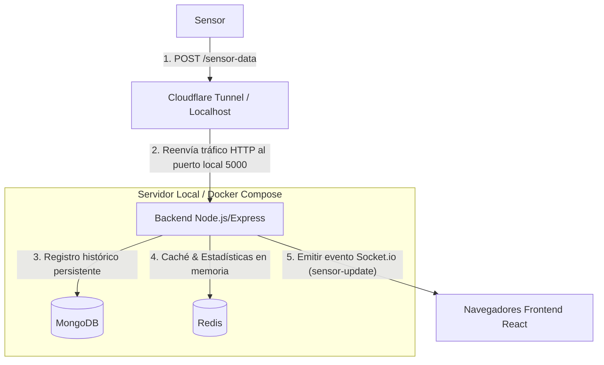
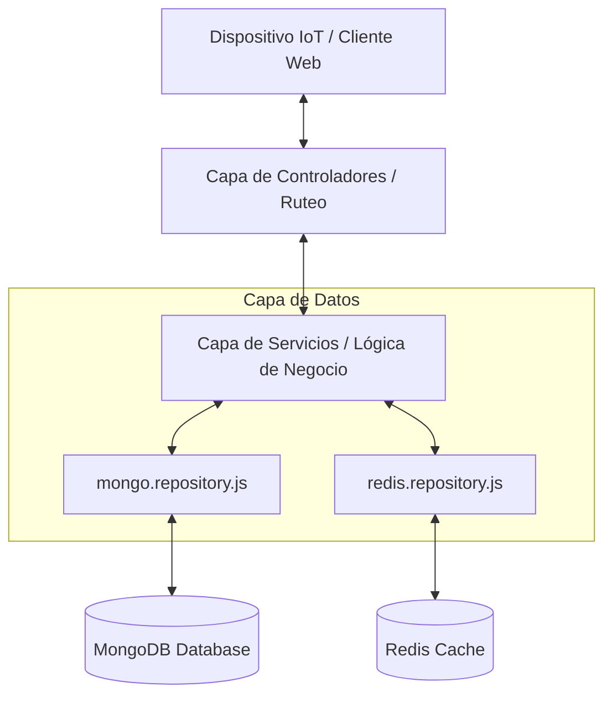

# Taller 5 - Monitorizacion de Sensores IoT 

Este proyecto consiste en un sistema de monitoreo IoT que recopila datos de sensores, los persiste de forma histórica en MongoDB, calcula estadísticas y maneja caché en Redis con ultrabaja latencia, y transmite las actualizaciones en tiempo real mediante WebSockets (Socket.io) a un Dashboard interactivo.

---

## 1. Arquitectura del Sistema y Software

### A. Arquitectura del Sistema 



### B. Arquitectura de Software 



---

## 2. Estructura del Proyecto

El repositorio está organizado en las siguientes carpetas principales:

```
taller5-IoT/
├── backend/                 # Node.js + Express
│   ├── src/
│      ├── config/           # Conexión a Bases de Datos (MongoDB y Redis)
│      ├── controllers/      # Controladores HTTP 
│      ├── models/           # Definición de Modelos (Mongoose / MongoDB)
│      ├── repositories/     # Interfaces de Acceso a Datos (Mongo / Redis)
│      ├── services/         # Capa de Lógica de Negocio y Procesamiento
│      └── server.js         # Servidor Principal e inicialización de Socket.io
│   
│   
├── frontend/                 # Aplicación Web (React + Vite)
│   ├── src/
│      ├── components/       # Componentes visuales 
│      │   ├── AlertPanel.jsx          # Panel interactivo de alertas críticas
│      │   ├── HistoryTable.jsx        # Tabla con búsqueda y refresco de MongoDB
│      │   ├── MetricCard.jsx          # Tarjetas (Temp / Hum) con estadísticas
│      │   ├── RealTimeChart.jsx       # Gráfica en tiempo real con Recharts
│      │   └── WaterLevelIndicator.jsx # Tanque de agua interactivo con efecto líquido
│      ├── App.jsx           # Componente raíz y lógica del cliente Socket.io
│      ├── index.css         # Estilos globales y Tailwind CSS
│      └── main.jsx          # Punto de entrada de la aplicación
│   
├── docker-compose.yml        # Orquestación de MongoDB y Redis
├── simulator.js              # Simulador en Node.js de dispositivo ESP32
└── README.md                 # Documentación 
```

---

## 3. Guía de Inicio Rápido (Local)

### Requisitos Previos
- [Node.js](https://nodejs.org/) (Versión 18 o superior para soporte nativo de `fetch` en el simulador)
- [Docker Desktop](https://www.docker.com/products/docker-desktop/) (para levantar MongoDB y Redis)

---

### Paso 1: Iniciar las Bases de Datos en Docker
Ejecutar el siguiente comando en la raíz del proyecto:

```bash
docker compose up -d
```

*Verificar contenedores:*
- `docker compose ps` para constatar que los contenedores `iot-mongodb` (puerto `27017`) y `iot-redis` (puerto `6379`) se encuentran ejecutándose correctamente.

---

### Paso 2: Configurar e Iniciar el Backend
1. Navegar al directorio del backend e instalar las dependencias:
   ```bash
   cd backend
   npm install
   ```
2. Crear el archivo de variables de entorno `.env` a partir del archivo de ejemplo:
   ```bash
   cp .env.example .env
   ```
3. Ejecutar el servidor en modo desarrollo:
   ```bash
   npm run dev
   ```

El backend iniciará en `http://localhost:5000` y establecerá automáticamente las conexiones con MongoDB y Redis locales.

---

### Paso 3: Configurar e Iniciar el Frontend
1. En una nueva terminal, navegar al directorio del frontend e instalar las dependencias:
   ```bash
   cd ../frontend
   npm install
   ```
2. Iniciar el servidor de desarrollo de Vite:
   ```bash
   npm run dev
   ```


---

### Paso 4: Iniciar el Simulador de Sensores para Pruebas
En una nueva terminal en la raíz del proyecto, ejecutar el simulador. Este generará de manera realista datos fluctuantes de temperatura, humedad y nivel de agua (con lógica de drenaje y recarga) y los enviará al backend cada 10 segundos:

```bash
node simulator.js
```

---

## 4. Detalles de Almacenamiento y Estructuras en Redis

Para garantizar la ultra-baja latencia y respuestas inmediatas, el backend interactúa con Redis implementando las siguientes estructuras de datos:

1. **Último Dato Recibido (String)**
   - **Clave:** `sensor:latest:<deviceId>`
   - **Contenido:** Cadena JSON que representa el último registro del dispositivo. Permite responder consultas de estado actual instantáneamente sin interactuar con MongoDB.
   
2. **Historial de Tiempo Real Reciente (List)**
   - **Clave:** `sensor:history:<deviceId>`
   - **Estructura:** Lista en Redis limitada a un tamaño máximo de **10 elementos** utilizando la secuencia de comandos atómica `LPUSH` y `LTRIM`. Almacena en memoria RAM las últimas lecturas para que el frontend grafique la tendencia del dispositivo de inmediato al conectar.
   
3. **Métricas y Promedios Acumulados (Hash)**
   - **Clave:** `sensor:stats:<deviceId>`
   - **Estructura:** Hash de Redis con los siguientes campos matemáticos calculados dinámicamente de forma incremental (evitando re-calcular sobre toda la base de datos):
     - `totalCount`: Cantidad acumulada de lecturas de sensores procesadas.
     - `tempSum`: Sumatoria acumulada de temperaturas.
     - `humiditySum`: Sumatoria acumulada de humedad.
     - `tempAverage`: Promedio histórico exacto de temperatura.
     - `humidityAverage`: Promedio histórico exacto de humedad.
     - `lastNivelAgua`: Último nivel de agua registrado.
     - `lastTimestamp`: Marca de tiempo del último envío.

---

## 5. Modelo de Datos en MongoDB (Mongoose)

MongoDB almacena el historial persistente a largo plazo. Se define con el siguiente esquema (`SensorData`):

- **`deviceId`**: String (Obligatorio, con remoción de espacios).
- **`temperatura`**: Number (Obligatorio).
- **`humedad`**: Number (Obligatorio).
- **`nivelAgua`**: Number (Obligatorio, entero restringido de `0` a `4`).
- **`timestamp`**: Date (Por defecto, fecha y hora actuales).

**Optimización:** Se configuró un índice compuesto indexando `{ deviceId: 1, timestamp: -1 }` para acelerar las consultas históricas filtradas u ordenadas por fecha en dispositivos específicos.

---

## 6. API REST y Protocolos de Comunicación

### Endpoints HTTP
1. **`POST /sensor-data`**
   - Recibe la telemetría del dispositivo IoT.
   - **Cuerpo de la petición (JSON):**
     ```json
     {
       "deviceId": "esp32_1",
       "temperatura": 25.4,
       "humedad": 62.1,
       "nivelAgua": 3
     }
     ```
   - **Respuestas:**
     - `201 Created`: Datos procesados, cacheados y difundidos con éxito.
     - `400 Bad Request`: Si algún campo no pasa las validaciones de tipo, rango u obligatoriedad.
     - `500 Internal Server Error`: En caso de fallo interno.

2. **`GET /sensor-data/current/:deviceId`**
   - Retorna el último estado, estadísticas y el historial en memoria para el dispositivo especificado a través de los datos recuperados de Redis.
   - **Respuesta (`200 OK`):** JSON con campos `deviceId`, `latest`, `history`, `stats` y `alerts`.

3. **`GET /sensor-data/history`**
   - Consulta el historial persistido directamente de MongoDB.
   - **Parámetros de consulta:** `?limit=N` (por defecto `100`).

---

### Comunicación en Tiempo Real (WebSockets / Socket.io)
El backend inicializa un servidor WebSocket en conjunto con HTTP. El flujo de eventos es el siguiente:

- **Al Conectar:** El cliente se registra.
- **`request-initial` (Cliente -> Servidor):** El cliente solicita el estado actual de un dispositivo (ej. `esp32_1`).
- **`initial-state` (Servidor -> Cliente):** El servidor responde con los datos almacenados en Redis para inicializar el Dashboard de manera inmediata.
- **`sensor-update` (Servidor -> Cliente):** Difusión masiva (broadcast) en tiempo real con la telemetría recién calculada, histórico actual de 10 elementos y estadísticas del dispositivo cada vez que se procesa exitosamente una petición `POST /sensor-data`.

---


## 7. Exposición Externa con Cloudflare Tunnel

Para conectar un microcontrolador físico ubicado fuera de la red local sin realizar mapeo de puertos en el router:

1. Instalar Cloudfare, este comando para windows:
   ```bash
   winget install Cloudflare.cloudflared
   ```
   
2. Levantar un Quick Tunnel desde cmd:
   ```bash
   cloudflared tunnel --url http://localhost:3000
   ```
3. Cloudflare proveerá una URL pública del tipo `https://XXXX-XXXX.trycloudflare.com`.
   
4. Configurar el microcontrolador físico o simulador local para dirigir sus peticiones hacia esa URL. Ejemplo:
   ```bash
   node simulator.js https://XXXX-XXXX.trycloudflare.com/sensor-data esp32_1
   ```
